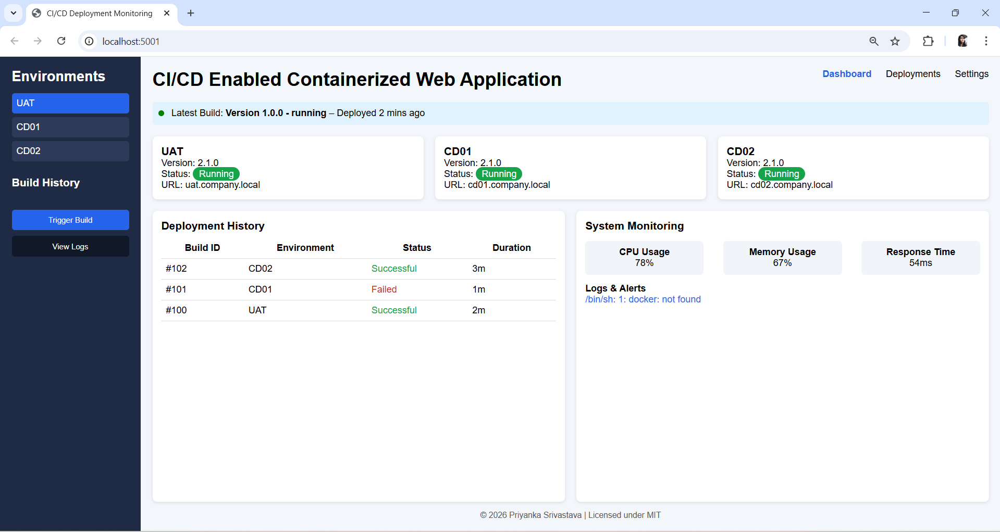

# CI/CD Enabled Web Monitoring Dasboard

## Project Overview
This project implements a CI/CD monitoring dashboard for containerized applications. 
The platform provides a centralized interface to monitor:
- CI/CD build executions
- deployment environments
- system health metrics
- application logs

The dashboard integrates with Jenkins pipelines and allows users to track build activity without directly accessing Jenkins.The project follows a branch-based development workflow with separate development and production environments.

## Project Objective

The goal of this project is to build a lightweight monitoring platform that provides visibility into CI/CD pipeline activity and containerized deployments.

### The system allows users to:
- Monitor CI/CD pipeline activity
- Trigger builds from the dashboard
- View job-wise build history
- Access console logs for each build
- Track deployments across environments
- Monitor containerized application status

This helps reduce the need to directly access Jenkins and provides a simplified monitoring interface.

## Key Features

- Centralized CI/CD monitoring dashboard
- Integration with Jenkins pipelines
- Build triggering from UI
- Job-wise build history tracking
- Console log viewing for each build
- Environment monitoring (Dev / Main)
- Containerized application deployment
- REST APIs for build and log retrieval
- Lightweight data storage using SQLite

## Technology Stack

1. Backend
- Python
- Flask

2. DevOps Tools
- Jenkins
- Docker
- Git

3. Infrastructure
- Linux (WSL Ubuntu environment)

4. Database
- SQLite

5. Frontend
- HTML
- CSS
- JavaScript

## Project Architecture

                +----------------------+
                |  Web Monitoring UI   |
                |  (Dashboard.html)    |
                +----------+-----------+
                           |
                           |
                    API Requests
                           |
                           v
                +----------------------+
                |    Flask Backend     |
                |   routes / services  |
                +----------+-----------+
                           |
        +------------------+------------------+
        |                                     |
        v                                     v
+---------------+                    +----------------+
|   Jenkins     |                    |    SQLite DB   |
| CI/CD Jobs    |                    | Build History  |
+---------------+                    +----------------+
        |
        v
+----------------+
| Docker Runtime |
| Application    |
+----------------+

## Project Directory Structure

automated-deployment-platform
│
├── app
│   ├── database.py
│   ├── models.py
│   ├── routes.py
│   ├── requirements.txt
│   ├── test_app.py
│   │
│   ├── static
│   │   ├── style.css
│   │   └── script.js
│   │
│   └── templates
│       └── dashboard.html
│
├── docker
│   └── Dockerfile
│
├── instance
│
├── main.py
├── Jenkinsfile
└── README.md

## Running Development Environment

1. Clone repository
git clone <repository-url>
cd automated-deployment-platform

2. Switch to development branch
git checkout dev

3. Create virtual environment
python3 -m venv venv
source venv/bin/activate

4. Install dependencies
pip install -r app/requirements.txt

5. Run development server
python3 main.py

6. Access dashboard
http://localhost:5001

## Running the Project Using Docker
Docker is used to run the application in a containerized environment.

### Build Docker Image

1. From the root directory:
docker build -t automated-deployment-platform:latest -f docker/Dockerfile .

2. Run Conatiner
docker run -d --name automated-app-dev --env-file .env -p 5001:5001 automated-deployment-platform

3. Dashboard runs on
http://localhost:5001

## ## Dashboard Preview

## Future Enhancements

- Multi-job Jenkins monitoring
- Job-wise build history
- Build console output viewer
- Ansible based automated deployments

## Author
Priyanka Srivastava